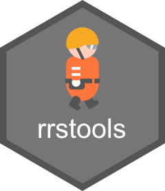

<!-- README.md is generated from README.Rmd. Please edit that file -->

```{r, include = FALSE}
knitr::opts_chunk$set(
  collapse = TRUE,
  comment = "#>",
  fig.path = "man/figures/README-",
  out.width = "100%"
)
devtools::load_all()
```

# rrstools 

<!-- badges: start -->

[](https://lifecycle.r-lib.org/articles/stages.html#experimental)
[](https://app.codecov.io/gh/NONONOexe/rrstools)
[](https://NONONOexe.r-universe.dev/rrstools)
<!-- badges: end -->

## Overview

rrstools is an R package for analyzing data from [RoboCupRescue Simulation (RRS)](https://rescuesim.robocup.org/), a disaster response simulation platform where autonomous agents work together to rescue civilians and minimize damage in a simulated urban earthquake disaster.
This package aims to support both competitors developing rescue agents and researchers studying multi-agent systems, by providing tools to read, visualize, and analyze RRS data such as map data and scenario configurations.

## Installation

You can install the development version of rrstools using the following methods:

### Using install.packages() (R-universe)

``` r
# Enable the R-universe
options(repos = c(
  nononoexe = "https://nononoexe.r-universe.dev",
  cran = "https://cloud.r-project.org"
))

# Install the package
install.packages("rrstools")
```

### Using pak

``` r
# install.packages("pak")
pak::pak("nononoexe/rrstools")
```

## Usage

### Reading and plotting map data

This package provides functions to read and plot RRS map data.

```{r example-map}
library(rrstools)

# Sample GML file bundled with the package
gml <- system.file("extdata", "map-test.gml", package = "rrstools")

# Read the map data from the GML file
map <- read_rrs_map(gml)

# Print the map data
map

# Plot the map data
plot(map)
```

### Overlaying scenario data

It is possible to overlay scenario data on the map.

```{r example-scenario}
# Sample scenario file bundled with the package
xml <- system.file("extdata", "scenario-test.xml", package = "rrstools")

# Read the scenario data from the XML file
scenario <- read_rrs_scenario(xml)

# Print the scenario data
scenario

# Plot the map with the scenario data
plot(map, scenario)
```

## Code of Conduct

Please note that this project is released with a [Contributor Code of Conduct](https://nononoexe.github.io/rrstools/CODE_OF_CONDUCT.html). By participating in this project you agree to abide by its terms.
