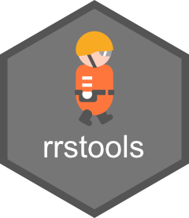
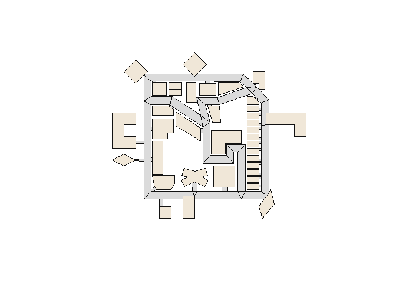

<!-- README.md is generated from README.Rmd. Please edit that file -->

# rrstools 

<!-- badges: start -->

[](https://lifecycle.r-lib.org/articles/stages.html#experimental)
[](https://CRAN.R-project.org/package=rrstools)

<!-- badges: end -->

## Installation

You can install the development version of rrstools using the following
methods:

### Using `install.packages()` (R-universe)

``` r
# Enable the R-universe
options(repos = c(
  nononoexe = "https://nononoexe.r-universe.dev",
  cran = "https://cloud.r-project.org"
))

# Install the package
install.packages("rrstools")
```

### Using `pak`

``` r
# install.packages("pak")
pak::pak("nononoexe/rrstools")
```

## Usage

This package provides functions to read and plot RRS map data.

``` r
library(rrstools)

# Sample GML file
gml <- system.file("extdata", "map-test.gml", package = "rrstools")

# Read the map data from the GML file
map <- read_rrs_map(gml)

# Print the map data
map
#> RoboCupRescue Simulation map object
#> Number of elements: nodes: 315 edges: 413 faces: 95
#> Bounding box: xmin: -30 ymin: -20 xmax: 135 ymax: 121

# Plot the map data
plot(map)
```



## Code of conduct

Please note that this project is released with a [Contributor Code of
Conduct](https://nononoexe.github.io/rrstools/CODE_OF_CONDUCT.html). By
participating in this project you agree to abide by its terms.
